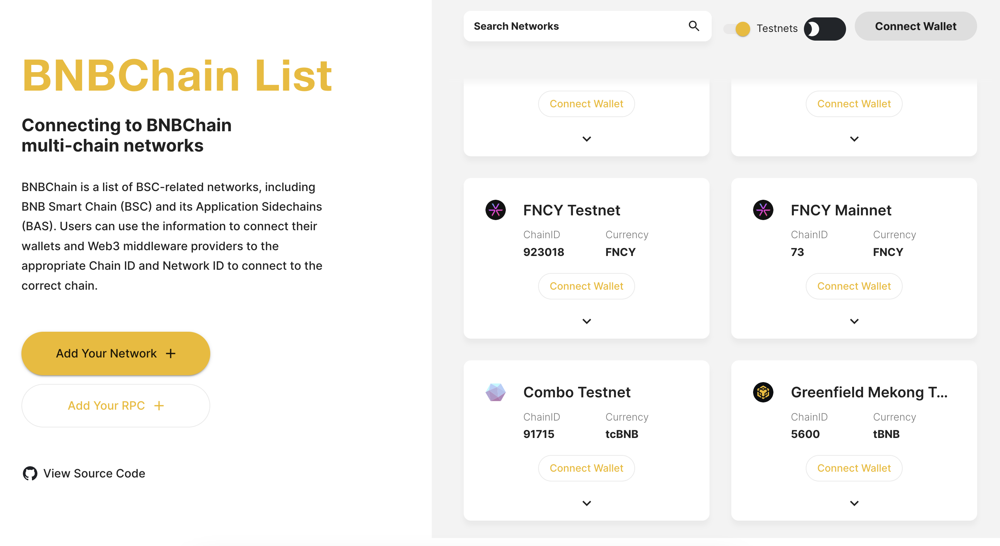
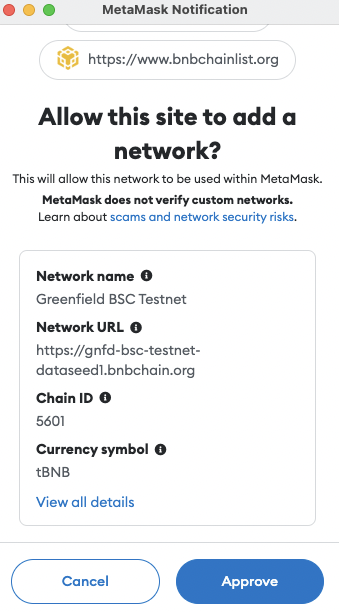
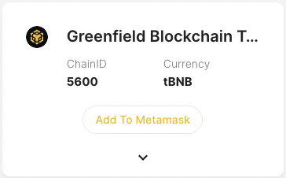
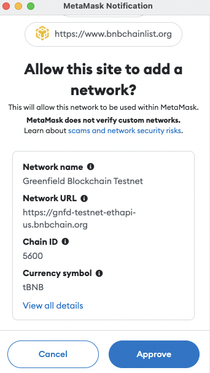
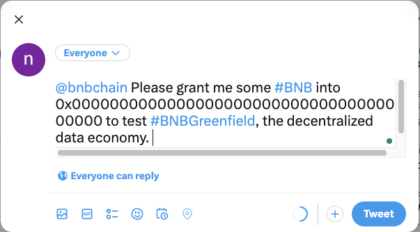

# Getting Started

Greenfield is a decentralized storage infrastructure within the broader BNB chain ecosystem where users and dApps can
create, store, and exchange data with full ownership to form a new data economy. BNB remains the main utility token on
Greenfield, which can be used to pay the gas fee and storage fees.

There is a native cross-chain bridge between Greenfield and BSC (BNB Smart Chain), and BNB can be transferred between BSC
and Greenfield. For more details about the cross-chain, you can refer to [Cross Chain](./greenfield-blockchain/modules/cross-chain.md).

Greenfield defines its account in the same format as BSC and Ethereum, with this compatible address scheme, you can
reuse existing accounts and infrastructure from BSC. For example, you can use TrustWallet and Metamask (or other
compatible wallets) to deposit your BNB from BSC to Greenfield and interact with dApps on Greenfield. It is also easy
to identify the same owner by referring to the same addresses on both BSC and Greenfield.

## Wallet Configuration

In this guide, you will learn how to use the MetaMask extension to interact with Greenfield Testnet and
Greenfield BSC Testnet, which is a fork of BSC and deployed dedicated for Greenfield Testnet.
::: info
Greenfield BSC Testnet is a temporary testnet for Greenfield, and it will be replaced by BSC Testnet in the future.
:::
We assume you have installed MetaMask and have an account, if not, please refer to [MetaMask](https://metamask.io/download/)
to install it.

### Add Greenfield BSC Testnet Network
1. Visit [BNBChain List](https://www.bnbchainlist.org/).
2. Click **Connect Wallet**.

<i>Connect Wallet</i>

3. Find **Greenfield BSC Testnet**, and click **Add To Metamask**.

<i>Add Greenfield BSC Testnet</i>

4. When MetaMask prompts a window, click **Approve**.

<i>Approve Add Greenfield BSC Testnet</i>

### Add Greenfield Testnet Network
1. Visit [BNBChain List](https://www.bnbchainlist.org/).
   2. Click **Connect Wallet** if wallet didn't connect.

<i>Connect Wallet</i>

3. Find **Greenfield Blockchain Testnet**, and click **Add To Metamask**

<i>Add Greenfield Testnet</i>

4. When MetaMask prompts a window, click **Approve**

<i>Approve Add Greenfield Testnet</i>

## Getting your test BNB

You can claim the test BNB on Greenfield BSC Testnet by the faucet, and bridge it to Greenfield Testnet.

### Faucet

1. Visit [Greenfield BSC Testnet Faucet](https://gnfd-bsc-faucet.bnbchain.org/).
2. Make a tweet with your BSC address.

<i>Faucet Tweet</i>

3. Find your tweet URL and copy it to request for tBNBs.
4. After receiving tBNBs, you can check them in your wallet.

### Bridge to Greenfield

[DCellar](http://dcellar.io) builds a bridge for transferring BNB from BSC to Greenfield and vice versa. You can follow
[How to Transfer In](http://dcellar.io) to bridge tBNBs from Greenfield BSC Testnet to
Greenfield Testnet.

## Interact with Greenfield

With tBNBs on Greenfield Testnet, you can interact with Greenfield, and start your decentralized data journey.

### DCellar

[DCellar](http://dcellar.io) is a file management tool and an ultimate client for Greenfield. With DCellar, you can
store and manage your files in a decentralized way, fully control your data, and even make profits out of them.
Meanwhile, you can also use DCellar to manage your account, balance, and billings.

### Greenfield Command

[Greenfield Command](https://github.com/bnb-chain/greenfield-cmd) is a powerful command line to interact with Greenfield,
by which you can manage your objects on Greenfield. This command line tool is under development, please stay tuned.

### SDK

If you are a developer, you can build your projects and interact with Greenfield base on SDK, here are several
resources you can refer to:
1. [Greenfield Go SDK](https://github.com/bnb-chain/greenfield-go-sdk)
2. [Greenfield JS SDK](https://github.com/bnb-chain/greenfield-js-sdk)
3. [Build DApps](./dapp)
