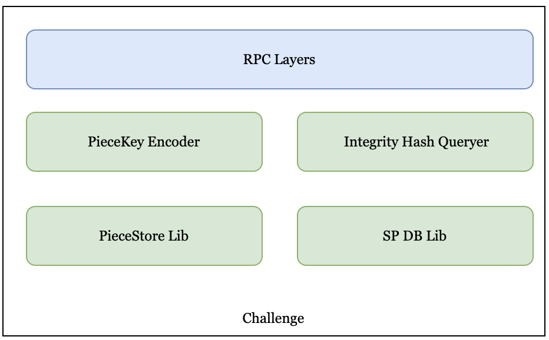

# Challenge
It is always the first priority of any decentralized storage network to guarantee data integrity and availability.
We use data challenge instead of storage proof to get better HA. There will be some data challenges to random
pieces on greenfield chain continuously. And the SP, which stores the challenged piece, uses the challenge workflow
to response. Each SP splits the object payload data to segments, and store segment data to piece store and store
segment checksum to SP DB.

## Overview
<div align=center></div>
<div align="center"><i>Challenge Architecture</i></div>

### PieceKey Encoder
According to the challenge information, encode into segment piece key or ec piece key.

### PieceStore Lib
Access the underlying piece storage, which may be different types of storage, such as local files, remote object storage, etc.

### Integrity Hash Queryer
Query the integrity hash and Piece Hash information stored in this SP for the corresponding Object.

### SP DB Lib
Lib for accessing the underlying SP DB currently supports MySQL and may adapt to more underlying indexing services in the future.

## Challenge Piece Workflow
* Receives the Challenge request from the Gateway.
* Returns all piece data checksums and challenge piece data payload to the Gateway service.
    * Retrieve all piece data checksums from the SP DB.
    * Get the challenge piece data from the piece store.

## protocol
### RPC Interface
```protobuf
// ChallengePieceRequest is request type for the ChallengePiece RPC method.
message ChallengePieceRequest {
  // object_id defines the challenge object id
  uint64 object_id = 1;
  // segment_idx defines the challenge segment idx
  uint32 segment_idx = 2;
  // redundancy_idx defines the challenge redundancy idx
  // It is useless iff < 0, and as ec index iff > 0
  int32 redundancy_idx = 3;
}

// ChallengePieceResponse is response type for the ChallengePiece RPC method.
message ChallengePieceResponse {
  // piece_data defines the challenge segment data
  bytes piece_data = 1;
  // integrity_hash defines the integrity hash of the challenge replicate payload
  bytes integrity_hash = 2;
  // piece_hash defines the checksum of the challenge segment
  repeated bytes piece_hash = 3;
}
```
### SP DB Interface
```golang
// IntegrityMeta defines the payload integrity hash and piece checksum with objectID
type IntegrityMeta struct {
    ObjectID      uint64
    Checksum      [][]byte
    IntegrityHash []byte
    Signature     []byte
}
// ObjectIntegrity abstract object integrity interface
type ObjectIntegrity interface {
	// GetObjectIntegrity get integrity meta info by object id
	GetObjectIntegrity(objectID uint64) (*IntegrityMeta, error)
}
```
