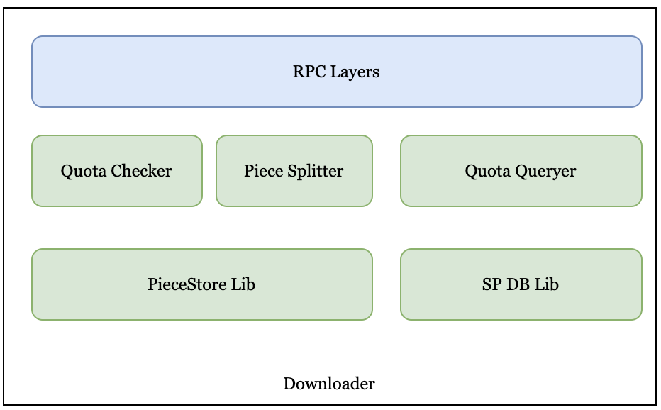

# Downloader
Downloader is responsible for downloading object data (including range download) and some query services
inside SP, such as querying bills and detailed information.

## Overview
<div align=center></div>
<div align="center"><i>Downloader Architecture</i></div>

### Quota Checker
Check the quota configuration of the Bucket, if it exceeds, return out of quota. If not, 
add a corresponding access record in the DB.

### Piece Splitter
According to the configured piece segment size, the access to Object is internally divided into access to Piece.

### PieceStore Lib
Access the underlying piece storage, which may be different types of storage, such as local files, 
remote object storage, etc.

### Quota Queryer
Provide Bucket Quota query interface and bill detail interface, and may provide more query interfaces in the future.

### SP DB Lib
Lib for accessing the underlying SP DB currently supports MySQL and may adapt to more underlying indexing services in the future.

## GetObject Workflow
* Receives the GetObject request from the Gateway service.
* Check whether the read traffic exceeds the quota.
    * If exceeds the quota, the Downloader refuses to serve and returns a not-enough-quota error to the Gateway.
    * If the quota is sufficient, the Downloader inserts read record into the SP traffic-db.
* Splits the GetObject request info the GetPiece requests(support range read) to get piece payload data, 
and returns the object payload data streaming to the Gateway.

## Protocol
### RPC Interface
* GetObject
```protobuf
// GetObjectRequest is request type for the GetObject RPC method.
message GetObjectRequest {
  // bucket_info defines the information of the bucket.
  bnbchain.greenfield.storage.BucketInfo bucket_info = 1;
  // object_info defines the information of the object.
  bnbchain.greenfield.storage.ObjectInfo object_info = 2;
  // user_address defines the request user address.
  string user_address = 3;
  // is_range indicate whether it is ranged get, compatible aws s3
  bool is_range = 4;
  // range_start defines the start of range, [range_start, range_end],
  // it is valid iff is_range is true.
  uint64 range_start = 5;
  // range_end defines the end of range, [range_start, range_end],
  // it is valid iff is_range is true.
  uint64 range_end = 6;
}
// GetObjectResponse is response type for the GetObject RPC method.
message GetObjectResponse {
  // data defines the download data
  bytes data = 1;
}
```
* GetBucketReadQuota
```protobuf
// GetBucketReadQuotaRequest is request type for the GetBucketReadQuota RPC method.
message GetBucketReadQuotaRequest {
  // bucket info from the greenfield chain
  bnbchain.greenfield.storage.BucketInfo bucket_info = 1;
  // year_month is the query bucket quota's month, like "2023-03"
  string year_month = 2;
}

// GetBucketReadQuotaResponse is response type for the GetBucketReadQuota RPC method.
message GetBucketReadQuotaResponse {
  // charged_quota_size is the greenfield chain bucket info's read quota size
  uint64 charged_quota_size = 1;
  // sp_free_quota_size is the sp default free quota
  uint64 sp_free_quota_size = 2;
  // consumed_size is currently consumed size
  uint64 consumed_size = 3;
}
```
* ListBucketReadRecord
```protobuf
// ListBucketReadRecordRequest is request type for the ListBucketReadRecord RPC method.
message ListBucketReadRecordRequest {
  // bucket info from the greenfield chain
  bnbchain.greenfield.storage.BucketInfo bucket_info = 1;
  // start_timestamp_us is the list request's left side, like [start_timestamp_us, end_timestamp_us)
  int64 start_timestamp_us = 2;
  // start_timestamp_us is the list request's right side, like [start_timestamp_us, end_timestamp_us)
  int64 end_timestamp_us = 3;
  // max_record_num is used to limit max list records
  int64 max_record_num =4;
}

// ReadRecord is used to record the read request.
message ReadRecord {
  // object_name is the read object name
  string object_name = 1;
  // object_id is the read object id
  uint64 object_id = 2;
  // account_address is the read account address
  string account_address = 3;
  // timestamp_us is the read time stamp
  int64 timestamp_us = 4;
  // read_size is the read object size
  uint64 read_size = 5;
}

// ListBucketReadRecordResponse is response type for the ListBucketReadRecord RPC method.
message ListBucketReadRecordResponse {
  // read_records are the read record list
  repeated ReadRecord read_records = 1[(gogoproto.nullable) = true];
  // next_start_timestamp_us is used to fetch next batch, When the list is completed, it is 0.
  int64 next_start_timestamp_us = 2;
}
```
### SP DB Interface
```golang
// Traffic define a series of traffic interfaces
type Traffic interface {
    // CheckQuotaAndAddReadRecord create bucket traffic firstly if bucket is not existed,
    // and check whether the added traffic record exceeds the quota, if it exceeds the quota,
    // it will return error, Otherwise, add a record and return nil.
    CheckQuotaAndAddReadRecord(record *ReadRecord, quota *BucketQuota) error
    // GetBucketTraffic return bucket traffic info,
    // notice maybe return (nil, nil) while there is no bucket traffic
    GetBucketTraffic(bucketID uint64, yearMonth string) (*BucketTraffic, error)
    // GetBucketReadRecord return bucket record list by time range
    GetBucketReadRecord(bucketID uint64, timeRange *TrafficTimeRange) ([]*ReadRecord, error)
}
```

