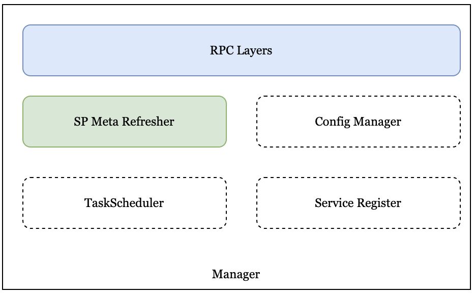

# Manager
The Manager module is responsible for the management work within the SP.

## Overview
<div align=center></div>
<div align="center"><i>Manager Architecture</i></div>

### SP Meta Refresher
It is responsible for periodically fetching the metadata from the chain to the internal database, 
and other modules can directly use the metadata in the database. Currently mainly includes storage 
parameters and the SP list.

### Config Manager
In the future, it will be used as the internal configuration manager of the SP to facilitate the 
unified update and distribution of the configuration information of the SP.

### Task Scheduler
In the future, it will be used as a task scheduler inside the SP, including background replicate 
tasks and GC tasks. It also performs fine-grained management of tasks, including task flow control, 
fail over, etc.

### Service Register
In the future, the SP internal microservice register will facilitate unified management of all 
microservices. It can quickly monitor the service quality of each microservice.

## Protocol
### SP DB Interface
```golang
// SPInfo interface
type SPInfo interface {
    // UpdateAllSp update all sp info, delete old sp info
    UpdateAllSp(spList []*sptypes.StorageProvider) error
    // SetOwnSpInfo set(maybe overwrite) own sp info
    SetOwnSpInfo(sp *sptypes.StorageProvider) error
}

// StorageParam interface
type StorageParam interface {
    // SetStorageParams set(maybe overwrite) storage params
    SetStorageParams(params *storagetypes.Params) error
}
```


